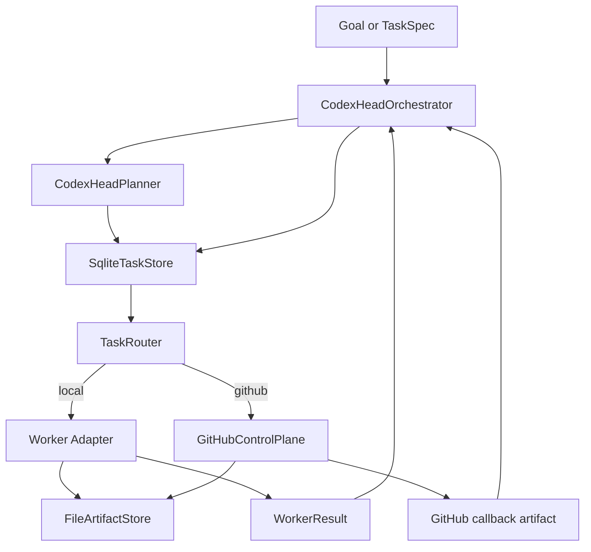

# Codex Head Architecture

`codex-head` keeps Codex App as the only head-brain in the system.

## Core Model

- Codex App owns planning, routing, synthesis, and final verdicts.
- Worker CLIs are subordinate executors:
  `claude-code`, `codex-cli`, `gemini-cli`, and `antigravity`.
- GitHub is a supporting control/data plane, not the planning authority.
- Methodology references come from:
  - [`../../cli-anything-plugin/HARNESS.md`](../../cli-anything-plugin/HARNESS.md)
  - [`../../codex-skill/SKILL.md`](../../codex-skill/SKILL.md)

## System Flow

## Main Subsystems

### Orchestrator

[`src/orchestrator.ts`](../src/orchestrator.ts) coordinates the full lifecycle:

- validates incoming tasks and results
- stores task specs and artifacts
- claims queued work
- resolves routing
- executes local adapters or prepares GitHub dispatch artifacts
- ingests worker callbacks
- enforces lineage, retry, and review aggregation rules

### Planner

[`src/planner/index.ts`](../src/planner/index.ts) converts a goal into a single
`TaskSpec` using lightweight heuristics:

- GitHub, PR, issue, workflow, or triage language -> `gemini-cli`
- implement, build, fix, refactor, refine, edit, or write code -> `claude-code`
- research, explore, or investigate -> `antigravity`
- everything else -> `codex-cli`

The planner also sets initial `expected_output`, `review_policy`,
`artifact_policy`, and `requires_github`.

### Router

[`src/router/index.ts`](../src/router/index.ts) picks the actual worker target:

- tries the requested `worker_target` first
- checks feature-flag state, adapter registration, GitHub support, and local
  binary health
- falls back by `expected_output.kind` if the primary target is unavailable

Fallback routing is type-driven, not free-form shell delegation.

### State Store

[`src/state-store/sqliteTaskStore.ts`](../src/state-store/sqliteTaskStore.ts)
persists queue state in SQLite using `node:sqlite`.

### Artifact Store

[`src/artifacts/fileArtifactStore.ts`](../src/artifacts/fileArtifactStore.ts)
writes per-task files under `runtime/artifacts/<task-id>/`.

### GitHub Control Plane

[`src/github/controlPlane.ts`](../src/github/controlPlane.ts) writes GitHub
mirror artifacts and workflow payloads but does not call GitHub APIs directly.

## Queue Lifecycle

The task lifecycle is fixed to:

`planned -> queued -> running -> awaiting_review -> completed|failed|canceled`

Allowed transitions are enforced in the SQLite store:

- `planned` -> `queued`, `canceled`
- `queued` -> `running`, `canceled`
- `running` -> `queued`, `awaiting_review`, `completed`, `failed`, `canceled`
- `awaiting_review` -> `completed`, `failed`, `canceled`
- `failed` -> `queued`, `canceled`

## Lineage And Completion Rules

- `TaskSpec` is the only task handoff contract from head-brain to worker.
- `WorkerResult` is the only completion contract from worker back to head-brain.
- Workers must not return shell commands for other workers to execute.
- If `expected_output.code_change` is `true` and
  `artifact_policy.require_lineage` is `true`, completion requires a `patch_ref`.
- A worker result must match the task's `task_id` and the actual routed worker
  target.
- The running task record stores the resolved `routing` as soon as dispatch
  begins, so fallback decisions remain visible before completion.

## Review Aggregation

When a task reaches `awaiting_review`, `codex-head` accepts reviewer verdicts
from either:

- `node dist/src/index.js review <task-id> <reviewer> <verdict> [summary]`
- `complete-from-file` with a `WorkerResult` callback from a required reviewer

The orchestrator stores reviewer artifacts under
`runtime/artifacts/<task-id>/review-<reviewer>.json` and aggregates them using
the task's `review_policy`:

- `changes_requested` from any required reviewer fails the task
- `require_all: true` requires approval from every listed reviewer
- `require_all: false` allows the task to complete after the first approval
- non-final comments keep the task in `awaiting_review`

## Internal-Beta Boundaries

Implemented now:

- planning, routing, queueing, retries, artifact generation, and callback
  ingestion
- CLI support for queue inspection and explicit enqueue before dispatch
- CLI support for deterministic `dispatch <task-id>`
- queue priority respected by `dispatch-next`

Not implemented yet:

- live GitHub issue or PR orchestration
- production-grade remote execution control plane
- budget enforcement beyond stored task metadata
